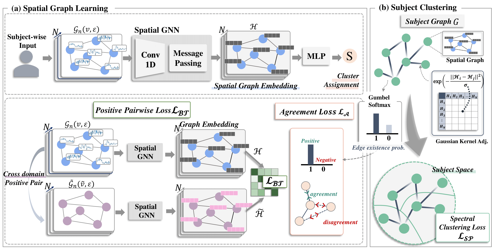

# SA-TSC
This repository contains the code of [SA-TSC] Self-Supervised Framework based on Subject-wise Clustering for Human Subject Time Series Data

# Dependencies
- CPU or NVIDIA GPU
- Python 3.7.16
- pytorch 1.13.0
- numpy 1.21.5
- pandas 1.3.5
- torch-cluster 1.6.1
- torch-geometric 1.0.3
- torch-scatter 2.0.4
- torch-sparse 0.6.17

# Datasets
We used three public datasets in this research.
80% of the data are used as the train set and the other 20% are used as test set. And for model finetuning '1 subject' or '2 subjects' are selected among the training dataset.
- HAR(https://archive.ics.uci.edu/dataset/240/human+activity+recognition+using+smartphones)
- ISRUC(https://sleeptight.isr.uc.pt/?page_id=48)
- SleepEDF(https://github.com/MousaviSajad/SleepEEGNet/blob/master/data_2013/download_physionet.sh)

# Training
SA-TSC provides two training phases:
- Pretrain Model (main_aug_v2.py)
- Finetuning Model (main_finetune.py)
  python main_aug_v2.py
  python main_finetune.py --subject 1 # performs finetuning w/ labels from 1 subject.
  python main_finetune.py --subject 2 # performs finetuning w/ labels from 2 subjects.
The pretrain model should be run before the finetuning model.

# Result
If csv_save == True in main_finetune.py, the result will be automatically saved in 'result_{data_set}.csv] file.
